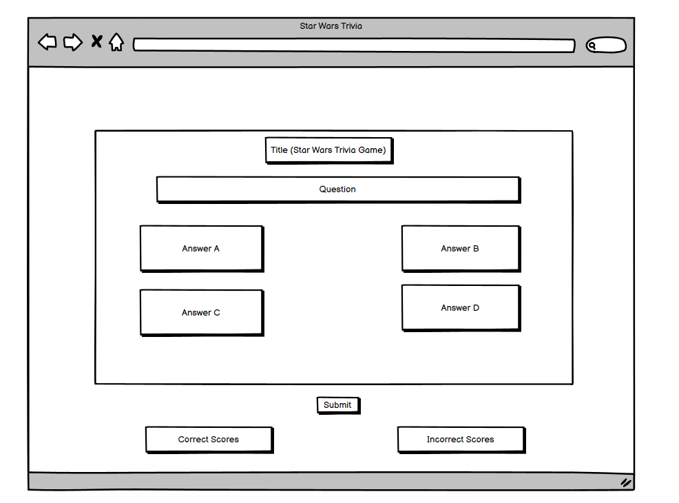
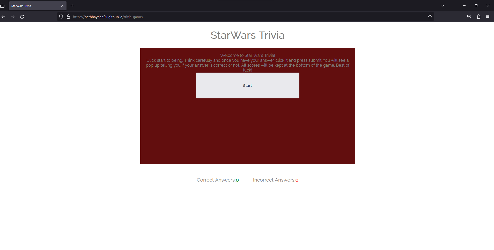
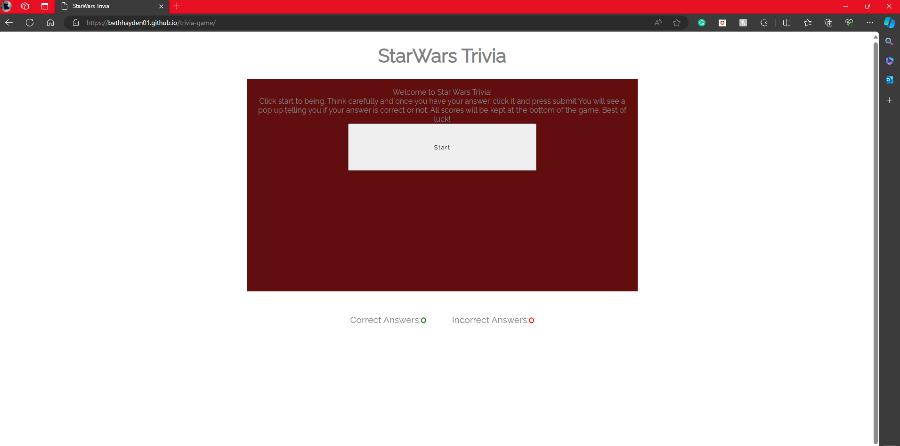
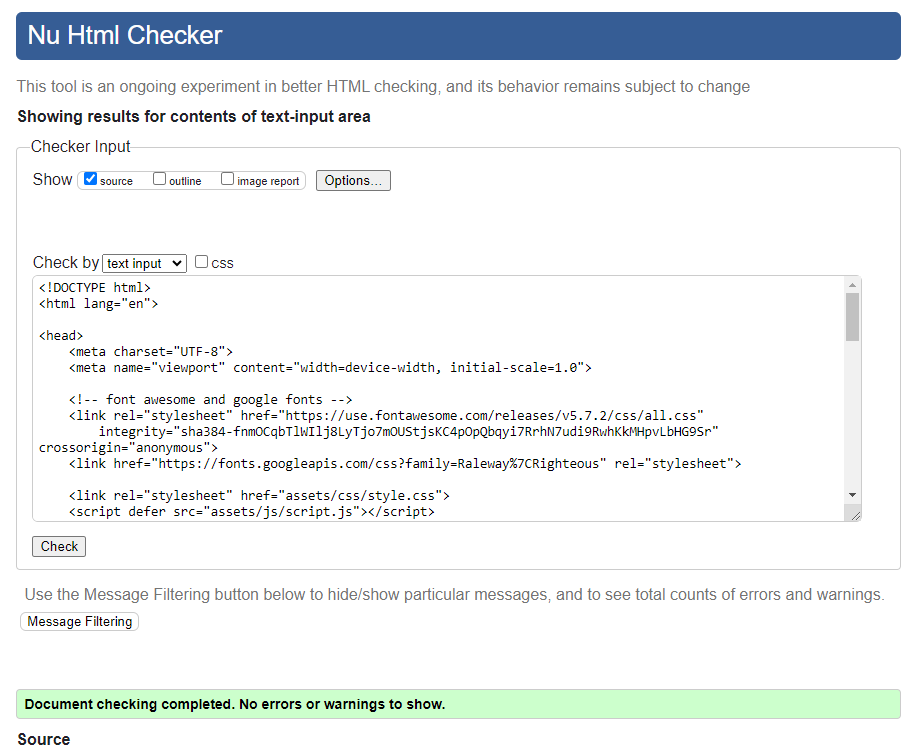
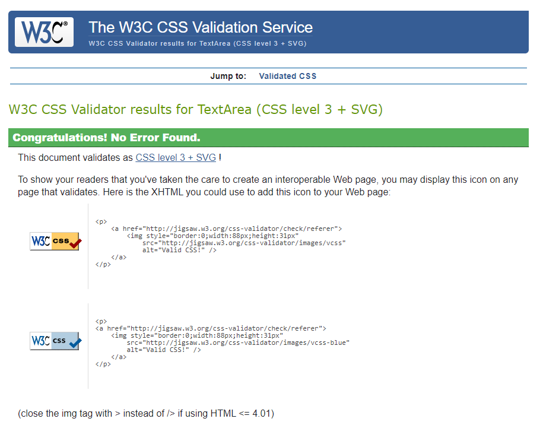
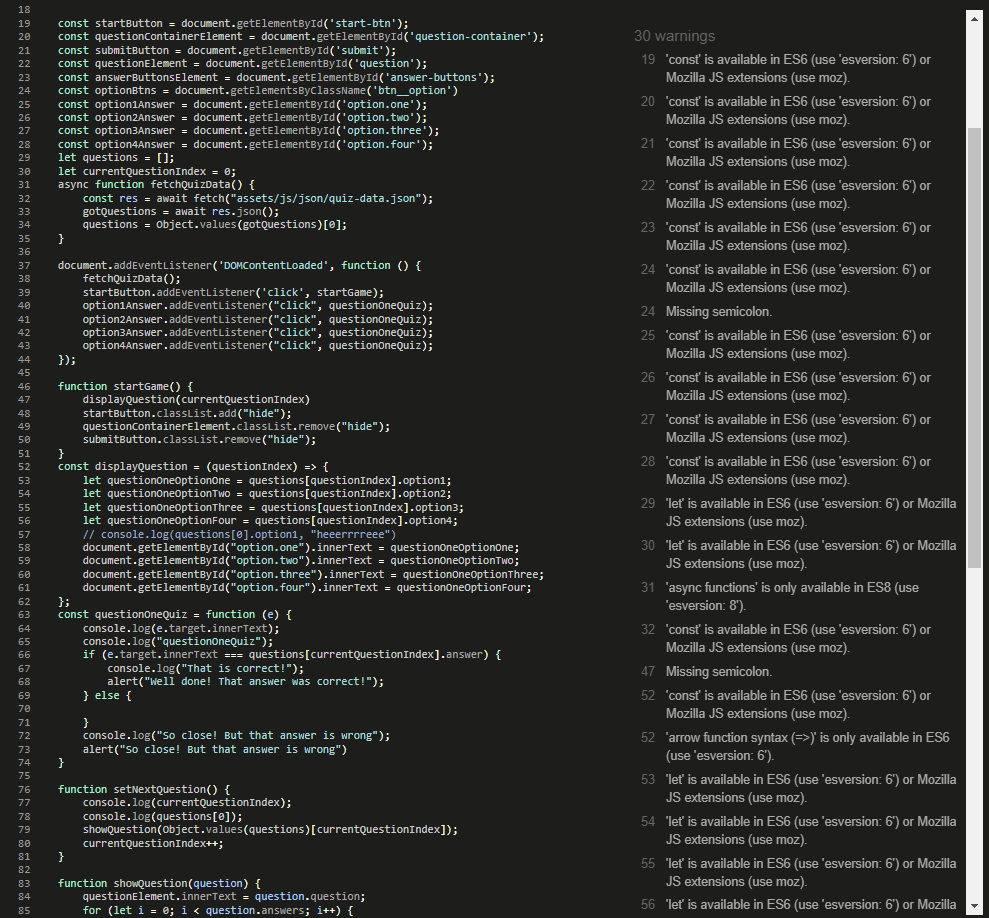

Star Wars Trivia Game. 

This Star Wars Trivia Game was uild in order to provide a fun and interactive game for Star Wars enthusiasts to test their knowledge of the series. 
The site can be accessed via this link [link](https://bethhayden01.github.io/trivia-game/)

## User Stories

### Initial user: 

* As a user accessing the game for the first time I want to be able to fully understand each element easily.

* As a user accessing the game for the first time I need to be able to clearly start the game.

* As a user accessing the game for the first time I need to be able to easily be able to select an answer. 

* As a user accessing the game for the first time I want to be able to gain feedback as to whether my answers are correct or not. 

### Returning user: 

* As a user reaccessing the page, I want to be able to reload the page easily to its initial state. 

* As a user reaccessing the page, I need to be presented with a new set of questions in order to test and expand my knowledge of the series. 

* As a user reaccessing the page, I need to be able to easily navigate to the page as I did the first time. 

## Features:

### Start screen

The start screen of the game shows the user a breif guid on how to use the game, as well as a start button to begin the quiz itself. 

Once the button is clicked the user will be taken to the first question in the quiz. 

The purpose of this page is to create a barrier at the start of the quiz so the user has a chance to read the instructions before begining the quiz. 

The instructions will remain throughout the quiz in case the user needs to refresh their memory on how to complete the quiz. 

### Quiz page

The quiz page itself will comprise of the intructions at the top of the page, the question just below, and the 4 option buttons. Below the 4 option buttons is a submit button for the user to submit their answer which in turn will increase the score counters below.

The purpose of the score counter is to enable the user to keep track of how many questions they have answered and how many they have guessed correctly or incorrectly. 

Once an answer is selected the user will be presented with an alert message informing them if they are correct or not. 

## Technologies used
- HTML was used as the base of the quiz.
- CSS was used to style the quiz throughout. 
- CSS Grid was used to style the answer buttons into a grid formation. 
- JavaScript was used to make the quiz interactive. 
- Balsamiq was used to generate the wireframe for the quiz. 
- VSCode was the tool used to write the code in its entirity. 
- Git was used to update the quiz code as it was writen.
- GitHub was used to use host the quiz. 

## Design 

Wireframe:

The colour scheme used for the quiz was intended to reflect that of the Star Wars films. 

The deep red background of the quiz provided clear contrast between the white background of the webpage, whilst representing the reds used throughout the films. 

Each colour for the option boxes were taken from elements within the films that provided enough contrast to the red background to stand out. 

### Unsolved Bugs

There are many unsolved bugs on this quiz site which shall be rectified at a later date. 

## Deployment 

- The quiz was deployed using GitHub as per the steps outlined below: 
- Navigate to the settings tab of the triviaquiz repository. 
- Select the pages option on the left hand menu list. 
- Choose to deploy from Main Branch and hit save. 
- Once these steps have been followed a link to the quiz will be generated at the top of the page. 

## Testing 

The quiz was run in Chrome, FireFox, and Microsoft Edge successfully. 

Chrome: 

Fireox: 

Edge:

HTML testing found no errors as shown below:

CSS testing found no errors as shown below: 

JavaScript testing found errors as shown below: 

## Future plans
For the completion and dvelopment of this project I intend to: 

- Ensure the score counter is working correctly.
- Provide better responses to the user with a potential response page. 
- Display the question and next question accuractly. 

## Achknowledgements

- [Iuliia-Konovalova](https://github.com/IuliiaKonovalova) was my mentor and a huge supporter of my website. She helped me greatly through the creation of my webpage.
- [Code-Institute](https://codeinstitute.net/) for it's helpful and clear tutorials, as well as the Slack community members for their insights.
- [Eddy-Ku](https://github.com/PalliateAi) for his support and insight into CSS code

